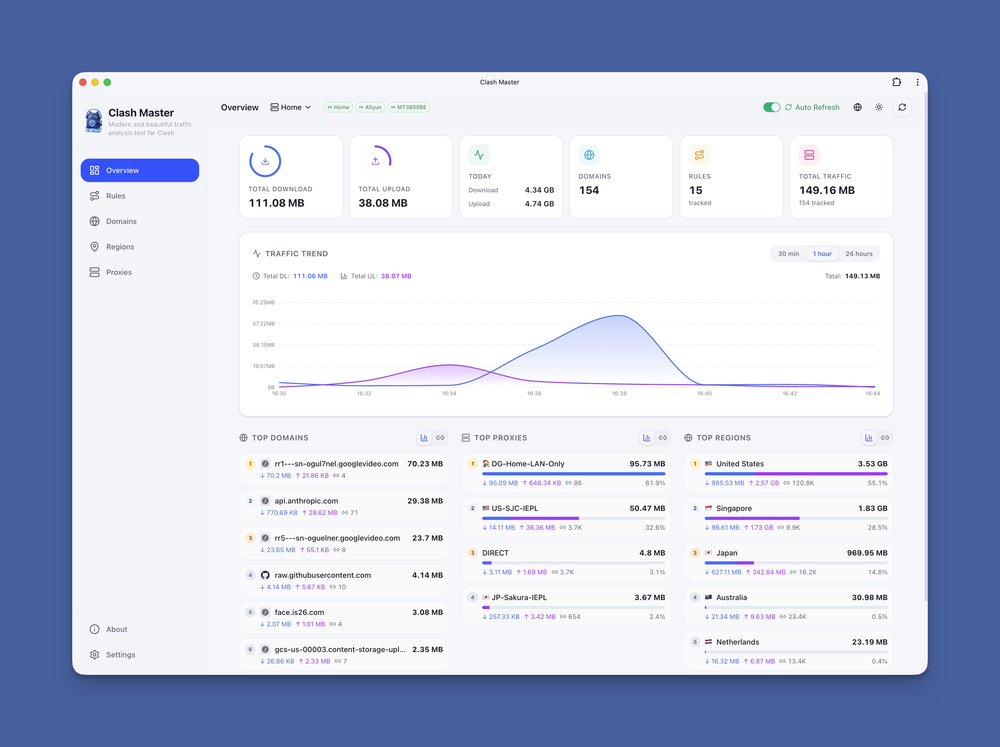
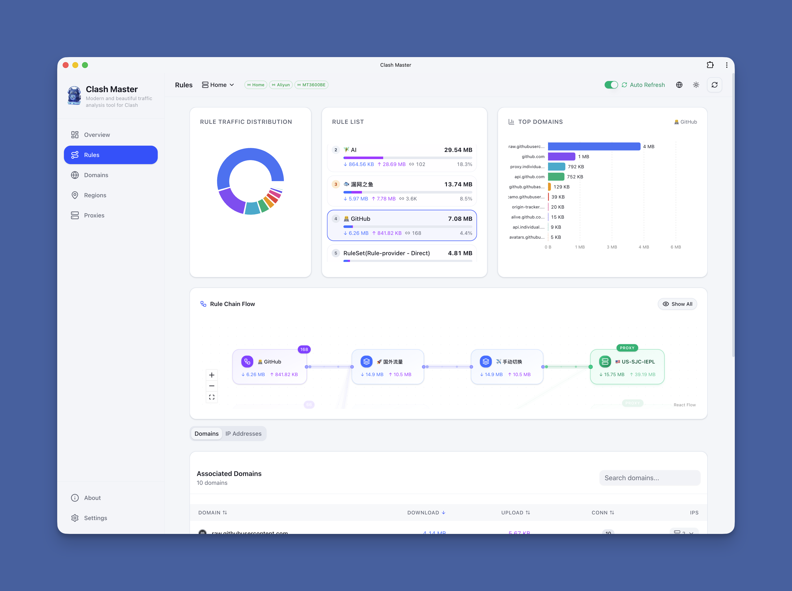
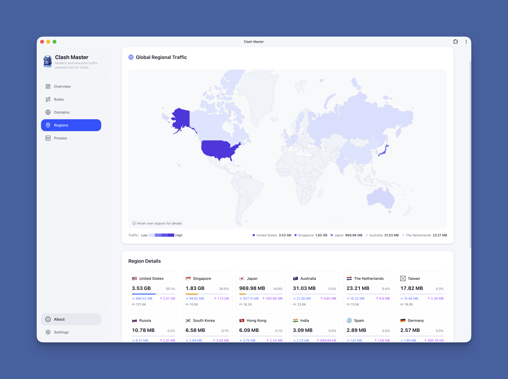
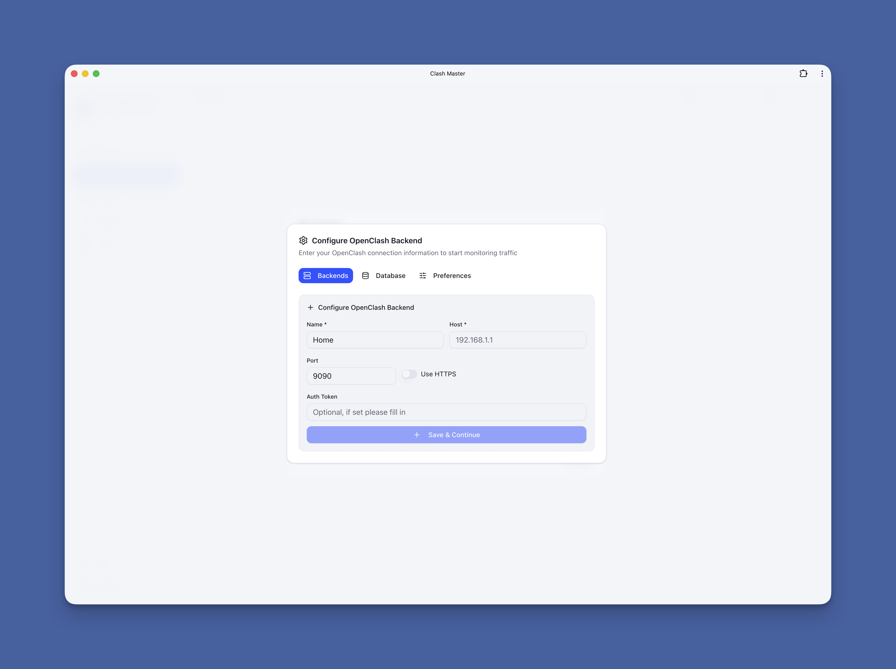

<p align="center">
  
  <br>
  <b style="font-size: 32px;">Clash Master</b>
</p>

<p align="center">
  <b>A more beautiful and modern web application that lets you visualize and manage your Clash network traffic</b><br>
  <span>Real-time Monitoring · Multi-dimensional Analysis · Multi-Backend Management</span>
</p>

<p align="center">
  <a href="https://github.com/foru17/clash-master/stargazers"></a>
  <a href="https://hub.docker.com/r/foru17/clash-master"></a>
  <a href="https://hub.docker.com/r/foru17/clash-master"></a>
  <a href="https://github.com/foru17/clash-master/blob/main/LICENSE"></a>
  
</p>

<p align="center">
  <a href="./README.md">简体中文</a> •
  <b>English</b>
</p>





## 📋 Table of Contents

- [✨ Features](#-features)
- [🚀 Quick Start](#-quick-start)
- [📖 First Use](#-first-use)
- [🔧 Port Conflict Resolution](#-port-conflict-resolution)
- [🐳 Docker Configuration](#-docker-configuration)
- [❓ FAQ](#-faq)
- [📁 Project Structure](#-project-structure)
- [🛠️ Tech Stack](#️-tech-stack)
- [📄 License](#-license)

## ✨ Features

| Feature                     | Description                                                   |
| --------------------------- | ------------------------------------------------------------- |
| 📊 **Real-time Monitoring** | WebSocket real-time collection with millisecond latency       |
| 📈 **Trend Analysis**       | Multi-dimensional traffic trends: 30min / 1h / 24h            |
| 🌐 **Domain Analysis**      | View traffic, associated IPs, and connection count per domain |
| 🗺️ **IP Analysis**          | ASN, geo-location, and associated domain display              |
| 🚀 **Proxy Statistics**     | Traffic distribution and connection count per proxy node      |
| 📱 **PWA Support**          | Install as desktop app for native experience                  |
| 🌙 **Dark Mode**            | Light / Dark / System theme support                           |
| 🌍 **i18n Support**         | English / Chinese seamless switching                          |
| 🔄 **Multi-Backend**        | Monitor multiple OpenClash backend instances simultaneously   |

## 🚀 Quick Start

### Option 1: Docker Compose (Recommended)

Create a `docker-compose.yml` file:

```yaml
services:
  clash-master:
    image: foru17/clash-master:latest
    container_name: clash-master
    restart: unless-stopped
    ports:
      - "3000:3000" # Web UI
      - "3001:3001" # API
      - "3002:3002" # WebSocket
    volumes:
      - ./data:/app/data
    environment:
      - NODE_ENV=production
      # External ports (optional; defaults are 3000/3001/3002)
      - WEB_EXTERNAL_PORT=3000
      - API_EXTERNAL_PORT=3001
      - WS_EXTERNAL_PORT=3002
      - DB_PATH=/app/data/stats.db
```

Then run:

```bash
docker compose up -d
```

Open <http://localhost:3000> to get started.

### Option 2: Docker Run

**Minimal (recommended, only Web exposed):**

```bash
docker run -d \
  --name clash-master \
  -p 3000:3000 \
  -v $(pwd)/data:/app/data \
  --restart unless-stopped \
  foru17/clash-master:latest
```

**Optional (only if you need direct API / WebSocket access):**

```bash
docker run -d \
  --name clash-master \
  -p 3000:3000 \
  -p 3001:3001 \
  -p 3002:3002 \
  -v $(pwd)/data:/app/data \
  --restart unless-stopped \
  foru17/clash-master:latest
```

Open <http://localhost:3000> to get started.

> The frontend uses same-origin `/api` by default, so only port 3000 is required.  
> Only expose 3001/3002 if you need direct API/WS access or do not proxy `/api`/`/ws` in Nginx.

> If you use custom external ports with `docker run`, also pass:
> `-e WEB_EXTERNAL_PORT=8080 -e API_EXTERNAL_PORT=8081 -e WS_EXTERNAL_PORT=8082`

### Option 3: One-Click Script

Automatically detects port conflicts and configures everything:

```bash
# Using curl
curl -fsSL https://raw.githubusercontent.com/foru17/clash-master/main/setup.sh | bash

# Or using wget
wget -qO- https://raw.githubusercontent.com/foru17/clash-master/main/setup.sh | bash
```

The script will automatically:

- ✅ Download `docker-compose.yml`
- ✅ Check if default ports (3000/3001/3002) are in use
- ✅ Suggest available alternative ports
- ✅ Create configuration file and start the service

### Option 4: Source Code

```bash
# 1. Clone the repository
git clone https://github.com/foru17/clash-master.git
cd clash-master

# 2. Install dependencies
pnpm install

# 3. Start development services
pnpm dev
```

Open <http://localhost:3000> to configure.

## 📖 First Use



1. Open <http://localhost:3000>
2. The **Backend Configuration** dialog will appear on first visit
3. Fill in your OpenClash connection info:
   - **Name**: Custom name (e.g., "Home")
   - **Host**: OpenClash backend address (e.g., `192.168.101.1`)
   - **Port**: OpenClash backend port (e.g., `9090`)
   - **Token**: Fill if Secret is configured, otherwise leave empty
4. Click "Add Backend" to save
5. The system will automatically start collecting data

> 💡 **Get OpenClash Address**: OpenClash Plugin → Enable "External Control" → Copy address

## 🔧 Port Conflict Resolution

If you see "port already in use" error, here are the solutions:

### Solution 1: Use .env File

Create a `.env` file in the same directory as `docker-compose.yml`:

```env
WEB_EXTERNAL_PORT=8080    # Change Web UI port
API_EXTERNAL_PORT=8081    # Change API port
WS_EXTERNAL_PORT=8082     # Change WebSocket port
```

Then restart:

```bash
docker compose down
docker compose up -d
```

Now access <http://localhost:8080>

### Solution 2: Directly Modify docker-compose.yml

```yaml
ports:
  - "8080:3000" # External 8080 → Internal 3000
  - "8081:3001" # External 8081 → Internal 3001
  - "8082:3002" # External 8082 → Internal 3002
```

> Note: the frontend reads external ports at runtime, so `NEXT_PUBLIC_WS_PORT` is no longer required.

### Solution 3: Use One-Click Script

```bash
curl -fsSL https://raw.githubusercontent.com/foru17/clash-master/main/setup.sh | bash
```

The script will automatically detect and suggest available ports.

## 🐳 Docker Configuration

### Ports

| Port |  Purpose  | External Required | Description |
| :--: | :-------: | :---------------: | :---------- |
| 3000 |  Web UI   |        ✅         | Frontend entry point |
| 3001 |    API    |       Optional     | Only needed for direct access/debug; frontend uses `/api` by default |
| 3002 | WebSocket |       Optional     | Real-time updates; can be proxied via Nginx `/ws` |

> You only need to reverse-proxy the Web UI in Nginx. The frontend uses same-origin `/api` by default,
> so 3001/3002 do not need to be exposed or configured unless you want direct API/WS access.

### Multi-Architecture Support

Docker images support both `linux/amd64` and `linux/arm64`.

### Data Persistence

Data is stored in `/app/data` inside the container. Mount it to host to prevent data loss:

```yaml
volumes:
  - ./data:/app/data
```

### Update to Latest

```bash
# Pull the latest image and restart
docker compose pull
docker compose up -d
```

## ❓ FAQ

### Q: "Port already in use" error?

**A:** See [Port Conflict Resolution](#-port-conflict-resolution) above. The simplest approach is to create a `.env` file with custom ports.

### Q: Cannot access after changing ports?

**A:** Make sure three things:

1. Ports are modified in `.env` file
2. Service is restarted: `docker compose restart`
3. You're using the new port (e.g., `http://localhost:8080`)

### Q: Failed to connect to OpenClash?

**A:** Check the following:

1. Is "External Control" enabled in OpenClash?
2. Is the OpenClash address correct? (Format: `IP:Port`)
3. If Secret is configured, is the Token correct?
4. Can the container access OpenClash's network? (Check firewall settings)

### Q: How to view service logs?

**A:**

```bash
# View all logs
docker logs -f clash-master

# View last 100 lines
docker logs --tail 100 clash-master
```

### Q: How to backup data?

**A:** Data is stored in the mapped directory (default `./data/stats.db`):

```bash
cp -r ./data ./data-backup-$(date +%Y%m%d)
```

### Q: How to clean up historical data?

**A:**

1. Click "Settings" at the bottom of the left sidebar
2. Switch to the "Database" tab
3. Select cleanup range: 1 day / 7 days / 30 days / All

## 📁 Project Structure

```
clash-master/
├── docker-compose.yml      # Docker Compose config
├── Dockerfile              # Docker image build
├── setup.sh                # One-click setup script
├── docker-start.sh         # Docker container startup script
├── start.sh                # Source code dev startup script
├── assets/                 # Screenshots and icons
├── apps/
│   ├── collector/          # Data collection service (Node.js + WebSocket)
│   └── web/                # Next.js frontend app
└── packages/
    └── shared/             # Shared types and utilities
```

## 🛠️ Tech Stack

- **Frontend**: [Next.js 16](https://nextjs.org/) + [React 19](https://react.dev/) + [TypeScript](https://www.typescriptlang.org/)
- **Styling**: [Tailwind CSS](https://tailwindcss.com/) + [shadcn/ui](https://ui.shadcn.com/)
- **Charts**: [Recharts](https://recharts.org/)
- **i18n**: [next-intl](https://next-intl-docs.vercel.app/)
- **Backend**: [Node.js](https://nodejs.org/) + [Fastify](https://www.fastify.io/) + WebSocket
- **Database**: [SQLite](https://www.sqlite.org/) ([better-sqlite3](https://github.com/WiseLibs/better-sqlite3))
- **Build**: [pnpm](https://pnpm.io/) + [Turborepo](https://turbo.build/)

## 🤝 Contributing

Contributions are welcome!

- 🐛 [Submit Bug](https://github.com/foru17/clash-master/issues/new)
- 💡 [Request Feature](https://github.com/foru17/clash-master/issues/new)
- 🔧 [Contribute Code](https://github.com/foru17/clash-master/pulls)

## 📄 License

[MIT](LICENSE) © [foru17](https://github.com/foru17)

---

## ⭐ Star History

[](https://www.star-history.com/#foru17/clash-master&type=date&legend=top-left)

---

<p align="center">
  <sub>Made with ❤️ by <a href="https://github.com/foru17">@foru17</a></sub><br>
  <sub>If this project helps you, please consider giving it a ⭐</sub>
</p>
